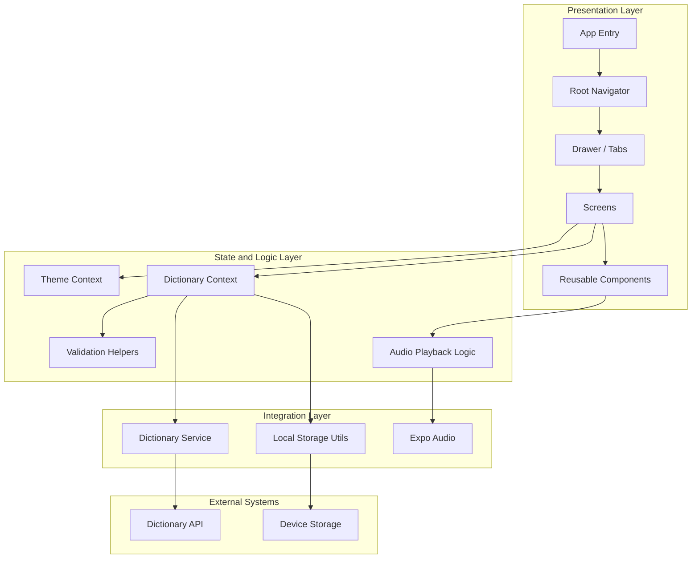

# LexiDict Application Architecture

## Architecture Summary

LexiDict is a mobile-first Expo application built around a small number of focused layers:

- **Presentation layer** handles screens, navigation, and reusable components.
- **State and logic layer** manages theme, dictionary search state, validation, and audio playback decisions.
- **Integration layer** handles API requests and local persistence.
- **External systems** provide the dictionary data and on-device storage.

## Key Modules

- `App.tsx`: application bootstrap, providers, onboarding.
- `src/navigation/RootNavigator.tsx`: top-level navigation.
- `src/navigation/DrawerNavigator.tsx`: drawer shell and app sections.
- `src/contexts/DictionaryContext.tsx`: search state, loading, errors, and history.
- `src/services/dictionaryService.ts`: API access and input validation.
- `src/utils/storage.ts`: local history and onboarding state.
- `src/screens/items/ItemListScreen.tsx`: search and definitions view.
- `src/screens/history/HistoryScreen.tsx`: search history management.
- `src/components/EmptyState.tsx`: reusable empty/error states.
- `src/components/LoadingIndicator.tsx`: loading feedback.
- `src/components/OnboardingModal.tsx`: first-run guidance.

