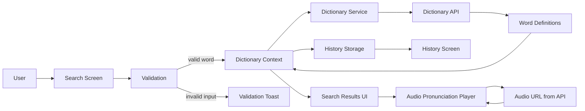

# LexiDict Data Flow Diagram

## Flow Notes

1. The user enters a word on the search screen.
2. The input is validated before any network request is made.
3. If validation fails, the user sees a message and no API request is sent.
4. If validation passes, the dictionary context requests definitions from the dictionary service.
5. The service calls the dictionary API and returns structured word data.
6. The UI renders definitions, phonetics, examples, and pronunciation controls.
7. Search terms are stored locally in history for quick access later.
8. If audio is available, the pronunciation player loads the selected audio URL but waits for user action before playback.

## Main Data Objects

- `DictionaryEntry`
- `Phonetic`
- `Meaning`
- `Definition`
- `SearchHistoryItem`

