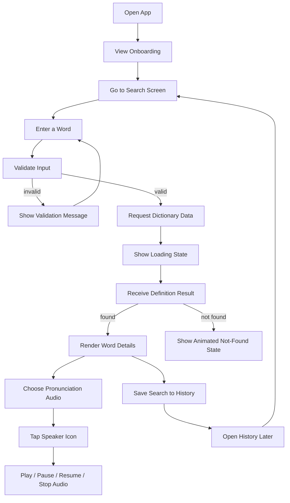

# LexiDict Flow Diagram

## Flow Summary

1. The app opens with onboarding.
2. The user lands on the search screen.
3. A word is entered and validated.
4. Invalid input stays on the search screen with a clear message.
5. Valid input triggers the dictionary lookup.
6. The app shows loading while the request is being processed.
7. A found word leads to definitions, examples, and pronunciation options.
8. A missing word leads to the animated not-found state.
9. The chosen word is stored in history for future access.

